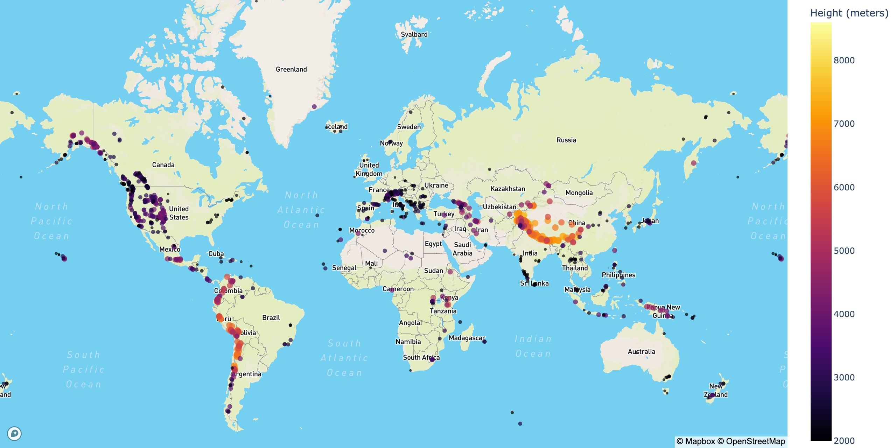
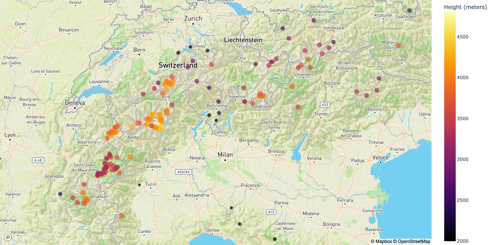
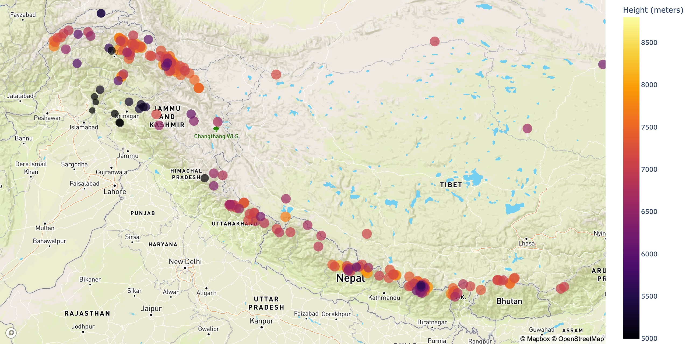
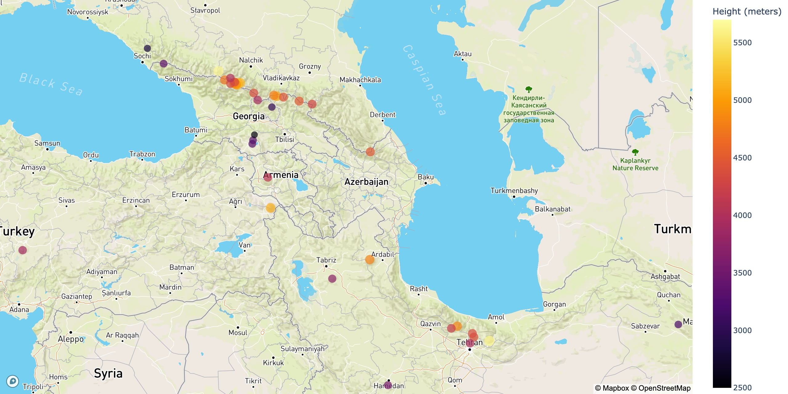
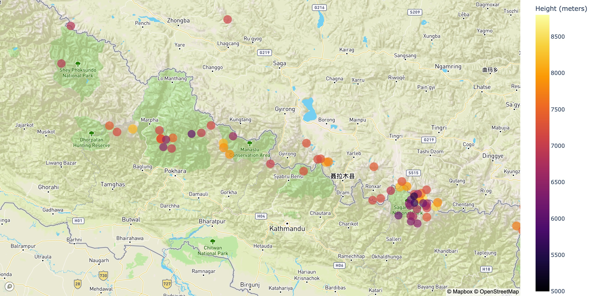
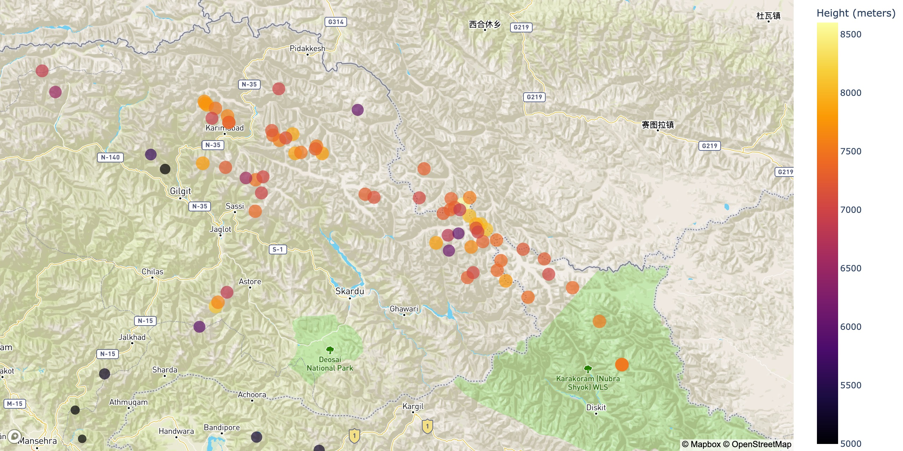
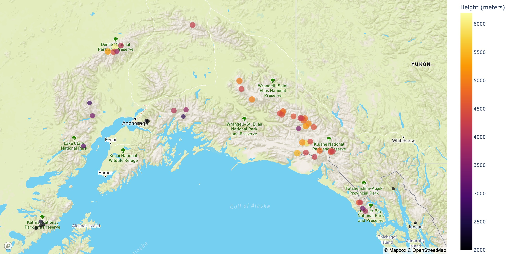
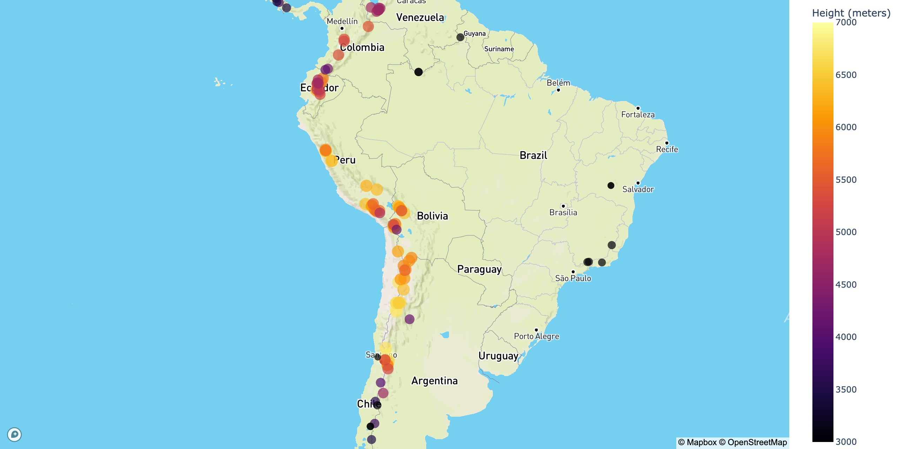

# Mountains Of The World

# Table Of Contents

- [Description](#Description)
- [Make Dataset](#Make-Dataset)
- [Visualize](#Visualize)

# Description

[(Back to top)](#Mountains-Of-The-World)

As a mountain addict I wanted to create a world map that would display all the highest mountains in the world.
With the use of colors it would be easy to see which, where and how high these mountains are.

# Make Dataset

[(Back to top)](#Mountains-Of-The-World)

For the making the dataset I used the following Wikipedia page: https://en.wikipedia.org/wiki/List_of_mountains_by_elevation. This page contains tables with highest mountains in the world. These tables are sorted in a range of a 1000 meters. Here it was possible to scrape the link to the individual mountains and the height in meters and feet. To scrape more data I had to scrape individual links and retrieve the Name of the mountain. To plot this data on a map I needed geographical data. The individual Wikipedia pages link to a page where you can find the latitude and longitude. After this I had all the data I needed tol create the maps.

# Visualize

[(Back to top)](#Mountains-Of-The-World)

First I started to look for a dataset that would contain all the highest mountains in the world.
At wikipedia I found the 'List of mountains by elevation' page.
This page contains multiple tables containing mountains of certain sizes (8000, 7000, etc).
It also contains the height, mountain range and location. I needed only the height for this project, so I scraped this.
For the coordinates of the mountains I needed to go to the individual pages of the mountains.
At these individual pages there is a link to coordinates.
From there I scraped the coordinates and put everything together in a dataframe.

This whole dataset is completely dynamic and could be updated whenever wanted.
From there I plotted everything on maps and saved the images.

## Alps

## Asia

## Caucasus

## Himalayas

## Karakoram

## North America

## South America

## World
