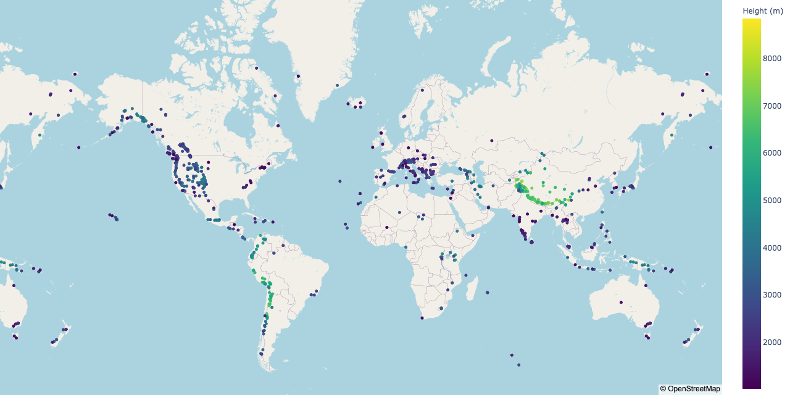

# Mountains of the world

# Contents

- [Description](#Description)
- [Dataset](#Dataset)
- [Workflow](#Description)

# Description

[(Back to top)](#Mountains-of-the-world)

As a mountain addict I wanted to create a world map that would display all the highest mountains in the world.
With the use of colors it would be easy to see which, where and how high these mountains are.

# Dataset

[(Back to top)](#Mountains-of-the-world)

Wikipedia (List of mountains by elevation):
https://en.wikipedia.org/wiki/List_of_mountains_by_elevation

# Workflow

[(Back to top)](#Mountains-of-the-world)

First I started to look for a dataset that would contain all the highest mountains in the world.
At wikipedia I found the 'List of mountains by elevation' page.
This page contains multiple tables containing mountains of certain sizes (8000, 7000, etc).
It also contains the height, mountain range and location. I needed only the height for this project, so I scraped this.
For the coordinates of the mountains I needed to go to the individual pages of the mountains.
At these individual pages there is a link to coordinates.
From there I scraped the coordinates and put everything together in a dataframe.

This whole dataset is completely dynamic and could be updated whenever I wanted.
From there I plotted everything on a map and saved the image.